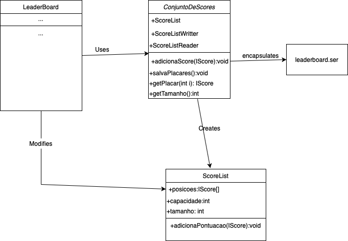
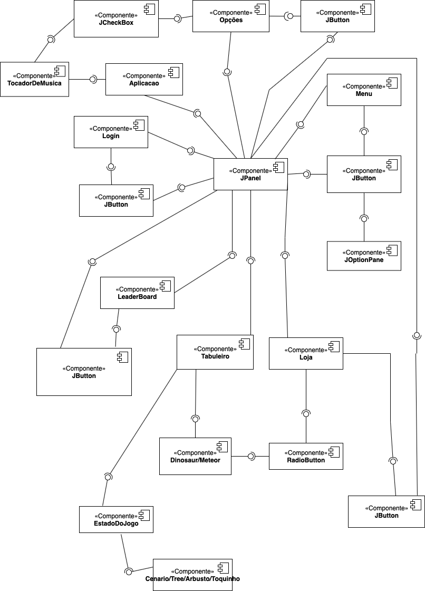
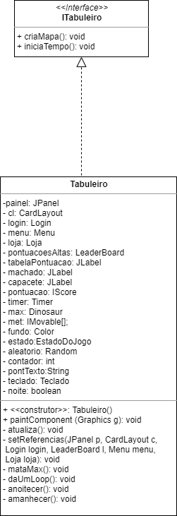
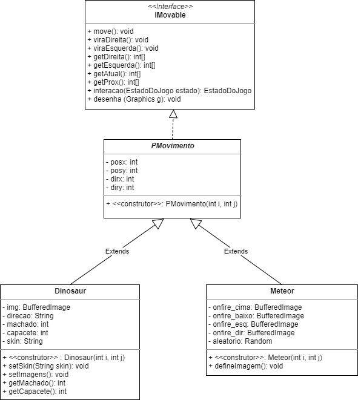
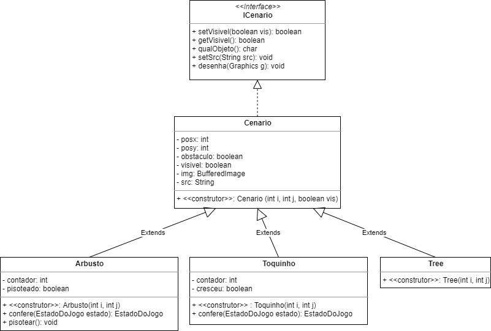
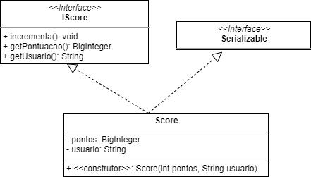

# Projeto DinosaurMaze

# Descrição Resumida do Jogo

   Os dinossauros estão correndo risco de extinção! Para que isso não ocorra, você precisa ajudar Max a fugir de alguns meteoros. O jogo ocorre em um espaço delimitado onde se encontram o dinossauro, Max, alguns meteoros e o cenário local: árvores, que terão que ser contornadas, e arbustos, que escondem surpresas que podem ajudar ou atrapalhar Max em sua jornada. Também é preciso ficar esperto com o tempo, já que durante a noite a capacidade de visão do protagonista é reduzida. O objetivo do jogo é conseguir o maior número possível de pontos. Para isso, faça com que o dinossauro sobreviva durante o máximo de tempo que conseguir. O jogo acaba quando um dos meteoros finalmente colide contra o dinossauro.

# Equipe
* David Afonso Borges dos Santos - 261032
* Mariana Sartorato Jorge - 241334

# Vídeos do Projeto

## Vídeo da Prévia
[Link do vídeo da prévia](https://www.youtube.com/watch?v=qXy4wn0Sr80)

## Vídeo do Jogo
[Link do jogo funcionando](https://www.youtube.com/watch?v=susYaTDGXnE)

# Slides do Projeto

## Slides da Prévia
[Link apresentação de slides da prévia](https://docs.google.com/presentation/d/1z7tYh_-3t55z-gPLHGo0pKrxIzfjaR9ctWesbCXJPjg/edit#slide=id.g86f2d35873_0_0)

## Slides da Apresentação Final
`<Coloque um link para os slides da apresentação final do projeto.>`

## Relatório de Evolução

Em um primeiro momento, buscamos decidir que tipo de jogo iríamos fazer. Para isso, começamos a listar jogos que gostamos e que se encaixassem em um espaço celular. Decidimos então seguir um padrão estilo pacman, um personagem principal procurando fugir de outros dentro de um espaço limitado. A partir disso, tivemos ideias que completassem o jogo e desse a nossa cara para ele. Inicialmente, decidímos por um dinossauro, fugindo de meteoros, que iria ter que comer toda comida disposta sobre o tabuleiro antes de ser capturado por uma bola de fogo. Pensamos também em algum tipo de ajuda que o dinossauro pudesse ter ao longo do jogo, o que nos levou aos arbustos escondendo objetos que ajudam ou atrapalham o personagem principal. Com o tempo, também decidimos colocar as árvores e adicionar a noite, para tornar o jogo mais emocionante. Uma mudança que acabamos fazendo foi contar a pontuação a partir do tempo que o personagem sobrevivia, não a partir de casas andadas ou peças comidas. Isso ocorreu para que o jogo pudesse durar mais tempo, não tendo assim um teto máximo de pontuação.

Com todas as ideias prontas, começamos a escrever o código. Foi um tanto diferente, pois foi o primeiro momento que mexemos com interface gráfica, então tivemos que procurar coisas a respeito, o que nos abriu um novo universo cheio de oportunidades. Ademais, outra ferramenta nova que utilizamos foi o timer do Java, importante para o projeto, mas que causou certo estranhamento no início. Com o desenvolvimento do projeto, novas ideias foram surgindo e sendo implementadas ao jogo, como a música de fundo e as mudanças de imagens. As principais dificuldades que encontramos ao longo do caminho foi saber como utilizar algumas ferramentas, nunca utilizadas anteriormente, como o cardlayout para mudar de página, ler, escrever e salvar os placares na lista e também colocar a música de fundo. Entretanto, após pesquisar bastante em fontes diversas, foi possível chegar ao resultado final.

Enquanto jogávamos, fomos percebendo algumas coisas que nos desagradavam, ou que tornavam o jogo um tanto quanto fácil, como as surpresas debaixo do arbusto e o uso do machado em certas circunstâncias. Apesar de, no princípio, serem aleatórias a cada novo jogo, se um jogador desse muita sorte poderia recolher muitos machados ou não ter buracos em seu caminho, e as surpresas se manteriam as mesmas embaixo de cada arbusto, sendo repostas a cada vez que recolhidas. Decidimos então que um novo arbusto apareceria após um personagem passar por cima desse, com uma outra surpresa aleatória embaixo. Também tomamos o cuidado para que não fosse possível o dinossauro ficar escondido o tempo todo em uma árvore, assim que utilizasse o machado, como ocorria nas primeiras versões do jogo. Agora, o jogador só pode ficar em umas dessas casas inalcançáveis por algumas rodadas.

# Destaques de Código

> <Escolha trechos relevantes e/ou de destaque do seu código. Apresente um recorte (você pode usar reticências para remover partes menos importantes). Veja como foi usado o highlight de Java para o código.>

~~~java
// cardLayout
public Menu() {
		
		botaoJogar = new JButton("Jogar");
		...
		add(botaoJogar);
		botaoJogar.addActionListener(
			(ActionEvent evento)->{
					tabuleiro.criaMapa();
					cl.show(painel, "tab");
					resetTimer();
					tabuleiro.requestFocus();
					tabuleiro.iniciaTempo();
			}
		);
		botaoPontuacoes = new JButton("Maiores pontuacoes");
		...
		add(botaoPontuacoes);
		botaoPontuacoes.addActionListener(
			(ActionEvent event)->{
					cl.show(painel, "leaderboard");
					resetTimer();
			}
		);
		botaoLoja = new JButton("Loja");
		...		
		add(botaoLoja);
		botaoLoja.addActionListener (
			(ActionEvent event)->{
					 cl.show(painel, "loja");
                                        resetTimer();
			}
		);
		botaoOpcoes = new JButton("Opcoes");
		...
		add(botaoOpcoes);
		botaoOpcoes.addActionListener(
			(ActionEvent event)->{
                                        cl.show(painel, "opcoes");
					resetTimer();
			}
		);
		
		...
	}

public Aplicacao () {
	super("Dinosaur Maze");
	painel.setLayout(cl);
	menu.setReferencias(painel, cl, tab);
	login.setReferencias(painel, cl);
	l.setReferencias(painel, cl, menu);
	loja.setReferencias(painel,cl,menu);
	opcoes.setReferencias(painel,cl,menu,tocador);
	painel.add(menu, "menu");
	painel.add(tab, "tab");
	painel.add(login,"login");
	painel.add(l, "leaderboard");
	painel.add(opcoes,"opcoes");
	painel.add(loja,"loja");
	
	...
}
~~~

~~~java
public ScoreListReader implements ILePlacar {
	...
	
	public ScoreList getListaPlacar() {
		ScoreList listaPlacar;
		abreArquivo();
		listaPlacar = leListaPlacar();
		fechaArquivo();
		return listaPlacar;
	}
}

public class ScoreListWritter implements IEscrevePlacar{
	...
	public void salvaListaPlacar (ScoreList listaPlacar) {
		abreArquivo();
		escreveListaPlacar(listaPlacar);
		fechaArquivo();
	}
}

public class LeaderBoard extends JPanel implements IPlacares{
	...
	public LeaderBoard() {
		...
		ListaPontos = scoreListReader.getListaPlacar();
		atualiza();
		...
	}
	...
	public void addScore(IScore placar) {
		ListaPontos.adicionaPontuacao(placar);
		atualiza();
	}

	public void atualiza() {
		for (int i = 0; i < ListaPontos.tamanho; i++) {
			placares[i].setText((i+1) + "." + ListaPontos.posicoes[i].getUsuario() + "  " + ListaPontos.posicoes[i].getPontuacao());
		}
	}
	
	public void salvaPlacar() {
		scoreListWritter.salvaListaPlacar(ListaPontos);
	}
	...
}
~~~

~~~java
// Arbustos

public class Arbusto {
	...
	
	public char qualObjeto() {
		if (pisoteado==false) {
			
			Random aleatorio = new Random();
			int num = aleatorio.nextInt(9);
			
			if (num % 2 == 0) {//0 2 4 6 8 buracos
				return 'b'; //buraco
			}
			if (num == 1) {
				return 'c'; //capacete
			}
			if (num == 3 || num == 5) { 
				return 'm'; //machadinho
			}
			return 'v'; //se o numero for 7 ou 9 retorna vazio
		}
		else {
			return 'n';
		}
	}

	public EstadoDoJogo confere(EstadoDoJogo estado) {
		if (pisoteado == true) {
			if (contador < 19) {
				contador++;
			}
			else {
				pisoteado = false;
				setVisivel(true);
				setSrc("novo_arbusto.png");
                		contador = 0;
			}
		}
		return estado;
	}
	
	public void pisotear() {
		pisoteado = true;
	}
}

public class Dinosaur {
	...
	public EstadoDoJogo interacao(EstadoDoJogo estado) {
		...
		if (efeito_atual == 'b') {
			((Arbusto)estado.getPeca(atual[0],atual[1])).pisotear();
			((Arbusto)estado.getPeca(atual[0],atual[1])).setVisivel(false);
		}
		else if(efeito_atual == 'c') {
			if (capacete<3) {
				capacete++;
			}
			((Arbusto)estado.getPeca(atual[0],atual[1])).pisotear();
			((Arbusto)estado.getPeca(atual[0],atual[1])).setVisivel(false);
			move();
			move();
		}
		else if (efeito_atual == 'm') {
			if (machado<3) {
				machado++;
			}
			((Arbusto)estado.getPeca(atual[0],atual[1])).pisotear();
			((Arbusto)estado.getPeca(atual[0],atual[1])).setVisivel(false);
			move();
		}
		else if (efeito_atual == 'v') {
			((Arbusto)estado.getPeca(atual[0],atual[1])).pisotear();
			((Arbusto)estado.getPeca(atual[0],atual[1])).setVisivel(false);
			move();
		}
		...
	}
}
~~~

~~~java
// Noite
private boolean noite = false;
public void paintComponent(…) {
   …
   if (noite==true) {
			int[] pos = max.getAtual();
			int cantoex = Math.max((pos[0]-1),0);
			int cantoey = Math.max((pos[1]-1),0);
			int cantodx = Math.min((pos[0]+2),20);
			int cantody = Math.min((pos[1]+2),20);
			g.setColor(Color.BLACK);
			g.fillRect(0,80,720,720);
			g.setColor(fundo);
			g.fillRect(cantoex*36,cantoey*36+80,(cantodx-cantoex)*36,(cantody-cantoey)*36);
			g.setColor(Color.BLACK);
			for (int i=cantoex;i<cantodx;i++) {
				for (int j=cantoey;j<cantody;j++) {
					g.drawLine(cantoex*36,80 + j * ritmo, cantodx*36, 80 + j * ritmo);
                                	g.drawLine(i * ritmo, cantoey*36+80, i * ritmo, cantody*36 + 80);
					if (estado.getPeca(i,j).qualObjeto()!='n') {
						estado.getPeca(i,j).setVisivel(true);
						estado.getPeca(i,j).desenha(g);
						estado.getPeca(i,j).setVisivel(false);
					}
				}
			}
			...
		} 
	...
}

...

BigInteger x = pontuacao.getPontuacao();
if (x.intValue() % 150 == 100) {
	anoitecer();
}
else if (x.intValue() % 150 == 0) {
	amanhecer();
}

....

private void anoitecer() {
	for (int i = 0; i < 20; i++) {
               	for (int j = 0; j < 20; j++) {
	                if(estado.getPeca(i,j).qualObjeto() != 'n')
        	                estado.getPeca(i,j).setVisivel(false);
                	}
        	}
		noite = true;
	}

private void amanhecer() {
	for (int i = 0; i < 20; i++) {
               	for (int j = 0; j < 20; j++) {
                       	if(estado.getPeca(i,j).qualObjeto() != 'n')
                       		estado.getPeca(i,j).setVisivel(true);
	                }
        }
	noite = false;
}

~~~

# Destaques de Pattern
`<Destaque de patterns adotados pela equipe. Sugestão de estrutura:>`

## Diagrama do Pattern
`<Diagrama do pattern dentro do contexto da aplicação.>`

## Código do Pattern
~~~java
// Recorte do código do pattern seguindo as mesmas diretrizes de outros destaques
public class ConjuntoDeScores {

        private ScoreListWritter scoreListWritter;
        private ScoreListReader scoreListReader;
        private ScoreList scoreList;

        public ConjuntoDeScores() {
                scoreListWritter = new ScoreListWritter();
                scoreListReader = new ScoreListReader();
                scoreList = scoreListReader.getListaPlacar();
        }

        public void adicionaScore(IScore novo) {
                scoreList.adicionaPontuacao(novo);
        }

        public void salvaPlacares() {
                scoreListWritter.salvaListaPlacar(scoreList);
        }

        public IScore getPlacar(int i) {
                return scoreList.posicoes[i];
        }

        public int getTamanho() {
                return scoreList.tamanho;
        }
}
~~~

> <Explicação de como o pattern foi adotado e quais suas vantagens, referenciando o diagrama.>
O pattern Data Access Object deixa a cargo do objeto ConjuntoDeScores de salvar e recuperar dados serializados na memória permitindo a persistência de pontuacoes. O fato do próprio objeto ser responsável por tais operações é muito importante, por exemplo, para o uso de banco de dados.
# Documentação dos Componentes

# Diagramas

## Diagrama Geral do Projeto

> <Apresente um diagrama geral de organização da organização do seu sistema. O formato é livre. A escolha de um ou mais estilos arquiteturais será considerado um diferencial.>

> <Faça uma breve descrição do diagrama.>

## Diagrama Geral de Componentes

### Exemplo 1

Este é o diagrama compondo componentes para análise:

Para cada componente será apresentado um documento conforme o modelo a seguir:

## Componente Tabuleiro

Onde o jogo ocorre, o espaço onde todas as peças serão alocadas e se movimentarão. Responsável por atualizar a posição de alguma peça quando essa realiza movimento, além de controlar o tempo.

**Ficha Técnica**
item | detalhamento
----- | -----
Classe | Tabuleiro
Autores | David e Mariana
Interfaces | ITabuleiro

### Interfaces

Interfaces associadas a esse componente:

Interface agregadora do componente em Java:

~~~java
public interface ITabuleiro {
	public void criaMapa();
	public void iniciaTempo();
}
~~~

## Detalhamento das Interfaces

### Interface `ITabuleiro`

Inicia o tabuleiro e o tempo, comecando o jogo.

~~~
public interface ITabuleiro {
	public void criaMapa();
	public void iniciaTempo();
}
~~~

Método | Objetivo
-------| --------
criaMapa() | Posiciona todas as peças no tabuleiro para iniciar o jogo
iniciaTempo() | inicia o timer

## Componente Peças com movimento

Dinossauro e meteoros, se deslocam pelo tabuleiro, seus movimentos definem a dinâmica do jogo, aumentando a pontuação ou determinando o fim do jogo.

**Ficha Técnica**
item | detalhamento
----- | -----
Classe | PMovimento
Autores | David e Mariana
Interfaces | IMovable

### Interfaces

Interfaces associadas a esse componente:

Interface agregadora do componente em Java:

~~~java
public interface IMovable {
	public void move();
	public void viraDireita();
	public void viraEsquerda();
	public int[] getDireita();
	public int[] getEsquerda();
	public int[] getAtual();
	public int[] getProx();
	public void desenha(Graphics g);
	public EstadoDoJogo interacao (EstadoDoJogo estado);
}
~~~

## Detalhamento das Interfaces

### Interface `IMovable`

Responsável pelo movimento das personagens, mostra as posições próximas as peças e determina o movimento que será realizado.

~~~
public interface IMovable {
	public void move();
	public void viraDireita();
	public void viraEsquerda();
	public int[] getDireita();
	public int[] getEsquerda();
	public int[] getAtual();
	public int[] getProx();
	public void desenha(Graphics g);
	public EstadoDoJogo interacao (EstadoDoJogo estado);
}
~~~

Método | Objetivo
-------| --------
move() | Movimenta a peça
viraDireita() | Vira para a direira
viraEsquerda() | Vira para a esquerda
getDireita() | Retorna o que tem na direita da personagem
getEsquerda() | Retorna o que tem na esquerda da personagem
getAtual() | Retorna a posição atual da personagem
getProx() | Retorna o que tem na casa da frente da personagem
desenha() | Desenha o componente
interacao() | Interacao das pecas que se movimentam com o cenario

## Componente Cenário

Peças que compõe a paisagem do jogo, são dispostas sobre o tabuleiro e interagem com as peças que se movimentam

**Ficha Técnica**
item | detalhamento
----- | -----
Classe | Cenario
Autores | David e Mariana
Interfaces | ICenario

### Interfaces

Interfaces associadas a esse componente:

Interface agregadora do componente em Java:

~~~java
public interface ICenario {
	public void setVisivel(boolean vis);
	public boolean getVisivel();
	public char qualObjeto();
	public void setSrc(String src);
	public void desenha(Graphics g);
}
~~~

## Detalhamento das Interfaces

### Interface `ICenario`

Relação do cenário com o resto do jogo, se está visível/invisível e qual o tipo de relação que exerce com os personagens que se movimentam.

~~~
public interface ICenario {
	public void setVisivel(boolean vis);
	public boolean getVisivel();
	public char qualObjeto();
	public void setSrc(String src);
	public void desenha(Graphics g);
}
~~~

Método | Objetivo
-------| --------
setVisivel() | Torna o objeto visível
getVisivel() | Retorna a visibilidade do objeto
qualObjeto() | Decide o tipo de objeto, um para árvores e quatro tipos para o arbusto, dependendo do que ele esconde 
setSrc() | Nome da imagem
desenha() | Desenha o objeto

## Componente Placar

Pontuação do jogador da rodada atual

**Ficha Técnica**
item | detalhamento
----- | -----
Classe | Score
Autores | David e Mariana
Interfaces | IScore

### Interfaces

Interfaces associadas a esse componente:

Interface agregadora do componente em Java:

~~~java
public interface IScore {
	public void incrementa();
	public BigInteger getPontuacao();
	public String getUsuario();
}
~~~

## Detalhamento das Interfaces

### Interface `IScore`

Incrementa a pontuação a cada rodada.

~~~
public interface IScore {
	public void incrementa();
	public BigInteger getPontuacao();
	public String getUsuario();
}
~~~

Método | Objetivo
-------| --------
incrementa() | Incrementa o placar
getPontuacao() | Retorna a pontuacao
getUsusario | Retorna o usuario

# Plano de Exceções

## Diagrama da hierarquia de exceções
`<Elabore um diagrama com a hierarquia de exceções como detalhado abaixo>`

## Descrição das classes de exceção

`<Monte uma tabela descritiva seguindo o exemplo>:`

Classe | Descrição
----- | -----
DivisaoInvalida | Engloba todas as exceções de divisões não aceitas.
DivisaoInutil | Indica que a divisão por 1 é inútil.
DivisaoNaoInteira | Indica uma divisão não inteira.
